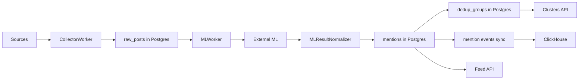
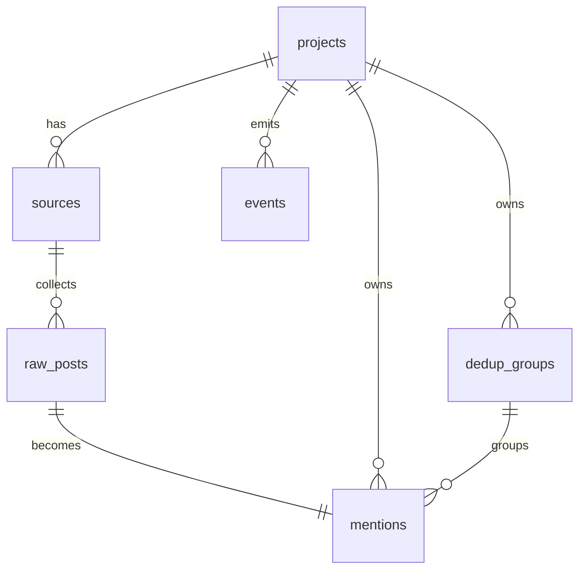
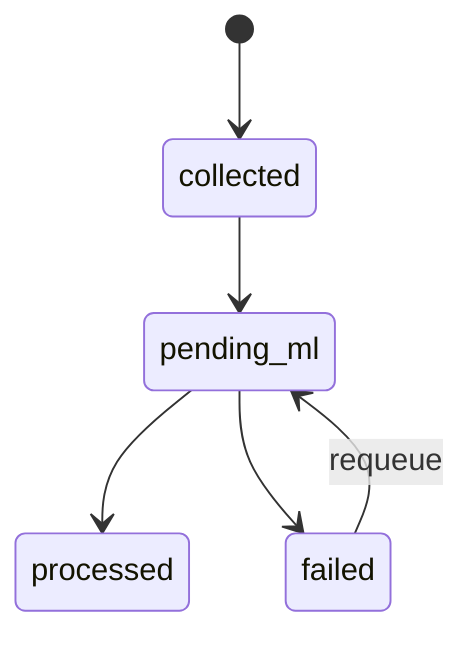
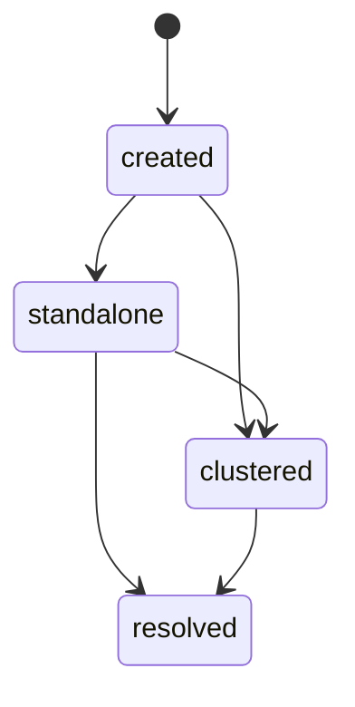

# Backend

Backend BrandRadar отвечает за сбор данных из источников, нормализацию и хранение сырого контента, ML-обработку, дедупликацию похожих публикаций и выдачу API для ленты, кластеров и служебного статуса системы.

Этот README задуман как основная точка входа в backend-часть проекта: по нему можно быстро понять устройство решения, проверить основной сценарий и найти детали в коде.

## Что решает backend

Backend закрывает весь серверный маршрут данных:

1. принимает конфигурацию проектов и источников;
2. собирает данные из `telegram`, `rss` и `website`;
3. сохраняет сырой контент в `raw_posts`;
4. отправляет подходящие записи в ML;
5. превращает результат ML в `mentions`;
6. объединяет похожие mentions в `dedup_groups`;
7. отдаёт ленту, кластеры, статусы обработки и health API.

Ключевая цель архитектуры: сохранить основной пользовательский сценарий даже при деградации внешних зависимостей вроде ML или ClickHouse.

## Быстрый старт

### Локальный запуск

Из корня репозитория:

```bash
cp .env.example .env
docker compose up -d --build
```

По умолчанию поднимутся:

- `python` на `http://localhost:8000`
- `web` на `http://localhost:3000` и `http://localhost`
- `postgres` на `localhost:5432`
- `clickhouse` на `localhost:8123`

### Swagger / OpenAPI

- Swagger UI: `http://localhost:8000/docs`
- OpenAPI JSON: `http://localhost:8000/openapi.json`

Основные API-эндпоинты находятся под префиксом `/api`, например:

- `GET /api/health`
- `GET /api/projects`
- `GET /api/feed`
- `GET /api/feed/clusters`

## Как быстро проверить основной сценарий

### 1. Проверить, что backend поднялся

```bash
curl http://localhost:8000/api/health
```

Ожидаемый результат:

- backend отвечает JSON;
- `postgres` должен быть `healthy`;
- `clickhouse` и `ml` могут быть `healthy` или `degraded`, но сервис должен отвечать.

### 2. Проверить, что есть bootstrap-проект и источники

```bash
curl http://localhost:8000/api/projects
curl http://localhost:8000/api/projects/1/sources
```

При старте backend сам создаёт bootstrap-проект `Brand Radar` и базовые источники.

### 3. Запустить сбор данных

```bash
curl -X POST http://localhost:8000/api/projects/1/collect -H "Content-Type: application/json" -d "{}"
```

Ответ должен вернуть статус запуска фоновой обработки.

### 4. Проверить статус коллектора и ML-очереди

```bash
curl http://localhost:8000/api/projects/1/collector/status
```

Смотри на поля:

- `raw_posts_total`
- `raw_posts_processed`
- `raw_posts_pending`
- `raw_posts_failed`
- `processing_status`

### 5. Проверить, что появились mentions и кластеры

```bash
curl http://localhost:8000/api/feed
curl http://localhost:8000/api/feed/clusters
```

Если внешний ML доступен и сбор дал новые данные, в выдаче появятся mentions и кластеры.

## Архитектура системы

### Компоненты

- `FastAPI` приложение: HTTP API, Swagger, healthcheck, middleware, exception handlers
- `Postgres + pgvector`: транзакционное ядро и источник истины
- `ClickHouse`: аналитическое хранилище событий mentions
- `CollectorWorker`: фоновый сбор данных из источников
- `MLWorker`: фоновая ML-обработка, сохранение mentions и sync в ClickHouse
- `ExternalMLGateway`: интеграция с внешним ML API
- `Collectors`: адаптеры для `telegram`, `rss`, `website`

Главная точка сборки зависимостей находится в [app/runtime.py](app/runtime.py).

### Маршрут данных



### Слои backend

- HTTP слой: [app/modules/brandradar/router.py](app/modules/brandradar/router.py)
- Сервисный слой: [app/modules/brandradar/service.py](app/modules/brandradar/service.py)
- Хранилище и транзакции: [app/infra/db/postgres.py](app/infra/db/postgres.py)
- Фоновые воркеры: [app/workers/collector_worker.py](app/workers/collector_worker.py), [app/workers/ml_worker.py](app/workers/ml_worker.py)
- ML-интеграция и нормализация: [app/ml/ml_gateway.py](app/ml/ml_gateway.py), [app/ml/normalizer.py](app/ml/normalizer.py)
- Интеграции с источниками: [app/collectors](app/collectors)
- Наблюдаемость и ошибки: [app/core/observability.py](app/core/observability.py), [app/core/exception_handlers.py](app/core/exception_handlers.py)

### Почему так

- роутеры остаются тонкими и не содержат бизнес-логики;
- сервис управляет сценариями и фоновыми задачами;
- Postgres store отвечает за состояние, ограничения и транзакции;
- внешние интеграции изолированы в collectors и gateways;
- тяжёлые и нестабильные операции вынесены в workers.

## Модель данных

### Ключевые сущности

- `projects`: проект мониторинга, содержит `keywords`, `exclude_keywords`, `risk_words`
- `sources`: источники проекта, из которых собирается контент
- `raw_posts`: сырой контент после collection
- `mentions`: результат ML-обработки одного raw post
- `dedup_groups`: кластеры похожих mentions
- `events`: служебные события backend

### Связи



### Где смотреть схему

- DDL и bootstrap: [app/infra/db/postgres.py](app/infra/db/postgres.py)
- SQL baselines: [app/infra/db/migrations/README.md](app/infra/db/migrations/README.md)

### Важные ограничения целостности

- `raw_posts`: `UNIQUE (source_id, external_id)`
- `mentions`: `UNIQUE (raw_post_id)`
- `sources.source_type`: ограниченный enum
- `poll_interval_s > 0`

Это защищает систему от части противоречивых записей уже на уровне БД.

## Переходы состояний

### Source

Backend хранит источник как сущность `sources`, а его оперативный статус считается сервисом в runtime:

- `idle`: источник ещё не собирался
- `ok`: сбор идёт по расписанию
- `stale`: источник давно не обновлялся
- `error`: последняя попытка завершилась ошибкой

Логика вычисления статуса находится в [app/modules/brandradar/service.py](app/modules/brandradar/service.py).

### Raw post



Где это видно:

- сбор и вставка: `save_raw_posts()`
- выборка очереди: `fetch_unprocessed_raw_posts()`
- permanent failure: `mark_raw_posts_ml_failed()`
- requeue проекта: `reset_project_mentions_for_reprocessing()`
- requeue только failed: `requeue_failed_raw_posts_for_reprocessing()`

Все эти переходы реализованы в [app/infra/db/postgres.py](app/infra/db/postgres.py).

### Mention



Расшифровка:

- `created`: mention записан после ML;
- `standalone`: `dedup_group_id = null`, `is_primary = true`;
- `clustered`: mention попал в существующий или новый `dedup_group`;
- `resolved`: пользователь или клиент пометил запись как обработанную.

Переходы и обновление кластера происходят в [app/ml/normalizer.py](app/ml/normalizer.py) и [app/infra/db/postgres.py](app/infra/db/postgres.py).

## Основной сценарий работы системы

Ниже описан основной бизнес-сценарий, который backend поддерживает end-to-end.

1. Пользователь создаёт или обновляет проект.
2. Для проекта настраиваются источники.
3. Collector worker забирает due sources и собирает из них новые публикации.
4. Сырые публикации пишутся в `raw_posts`.
5. ML worker выбирает не обработанные raw posts.
6. Нормализатор решает, что отправлять в ML, а что можно отфильтровать локально.
7. Внешний ML возвращает классификацию, sentiment и embedding.
8. Backend сохраняет `mentions`, назначает `dedup_group_id`, пересчитывает кластер и помечает raw post как обработанный.
9. Feed API отдаёт primary mentions, а cluster API отдаёт агрегированные кластеры.

Практически это выглядит так:

- `POST /api/projects/{project_id}/collect`
- `GET /api/projects/{project_id}/collector/status`
- `GET /api/feed`
- `GET /api/feed/clusters`
- `GET /api/projects/{project_id}/mentions?dedup_group_id=<id>`

## Внешние интеграции

### Поддерживаемые источники

В runtime сейчас реально подключены:

- `telegram`
- `rss`
- `website`

Важно: в схемах и enum значениях есть `vk` и `dzen`, но collectors для них сейчас не wired в runtime.

### ML

Backend интегрируется с внешним ML API:

- base URL: `EXTERNAL_ML_BASE_URL`
- predict path: `EXTERNAL_ML_PREDICT_PATH`
- health path: `EXTERNAL_ML_HEALTH_PATH`

Gateway находится в [app/ml/ml_gateway.py](app/ml/ml_gateway.py).

### ClickHouse

ClickHouse используется как аналитический слой для событий mentions. Основной сценарий не зависит от него жёстко: если ClickHouse недоступен, backend продолжает работать в degraded mode, а sync остаётся отложенным.

## Тестирование

### Что покрыто

Backend-тесты лежат в [tests](tests) и покрывают критичные части сценария:

- схемы и валидацию запросов;
- API-контракты и фильтры;
- сервисную логику;
- репозиторный слой и SQL-фильтрацию;
- ML gateway и ML worker;
- reprocessing проекта;
- health и observability;
- collectors для `rss` и `website`.

Примеры:

- [tests/test_mentions_filters.py](tests/test_mentions_filters.py): проверка API-контрактов и фильтров
- [tests/test_mentions_repository.py](tests/test_mentions_repository.py): проверка SQL-логики и переходов данных
- [tests/test_ml_worker.py](tests/test_ml_worker.py): transient/permanent failures, fallback, sync
- [tests/test_project_reprocessing.py](tests/test_project_reprocessing.py): безопасный requeue и сохранение сценария
- [tests/test_health_service.py](tests/test_health_service.py): degraded/healthy поведение health
- [tests/test_observability.py](tests/test_observability.py): расчёт метрик

### Как запускать

Из корня репозитория:

```bash
python -m pytest backend/tests -q
```

Локально можно запускать и выборочно:

```bash
python -m pytest backend/tests/test_mentions_filters.py -q
python -m pytest backend/tests/test_mentions_repository.py -q
python -m pytest backend/tests/test_ml_worker.py -q
```

### Как мы контролируем, что изменения не ломают сценарий

- критичный backend-сценарий покрыт unit/integration тестами;
- CI прогоняет backend-тесты и публикует coverage/JUnit артефакты;
- отдельно есть frontend e2e на пользовательский сценарий кластеров;
- изменения в проектных фильтрах запускают controlled reprocessing вместо неявной порчи ленты.

Конфигурация CI находится в [../.gitlab-ci.yml](../.gitlab-ci.yml).

## Авторизация

На текущем этапе отдельной авторизации в backend нет. Это упрощение MVP: упор сделан на корректность pipeline, API-контракты и устойчивость обработки данных.

## Тестовые данные и bootstrap

При старте backend выполняет bootstrap:

- создаёт проект `Brand Radar`, если его ещё нет;
- создаёт базовые источники `telegram`, `website`, `rss`.

Это позволяет быстро проверить основной сценарий без ручной первичной настройки.

## Наблюдаемость и диагностика

Backend поддерживает:

- `GET /api/health`
- request metrics по окну времени
- логирование slow requests и 5xx
- вычисление статусов `healthy / degraded / unhealthy`
- диагностику отдельных зависимостей: `postgres`, `clickhouse`, `ml`

Смотреть:

- [app/core/observability.py](app/core/observability.py)
- [app/modules/brandradar/service.py](app/modules/brandradar/service.py)
- [app/main.py](app/main.py)

## Ограничения и осознанные компромиссы

- Сейчас wired только `telegram`, `rss` и `website`.
- `website` collector рассчитан на публичные HTML-страницы; сайты с тяжёлым JS-rendering могут потребовать отдельной адаптации.
- История миграций пока упрощена: есть SQL baselines и bootstrap через `init_db()`, но нет полноценной forward-only migration chain уровня Alembic/Flyway.
- Sync в ClickHouse eventual-consistent: транзакционным источником истины остаётся Postgres.
- Внешний ML является критичной интеграцией для полной автоматической обработки, но backend умеет работать с деградацией этой зависимости.

## Где смотреть детали

- Точка входа приложения: [app/main.py](app/main.py)
- Сборка runtime и зависимостей: [app/runtime.py](app/runtime.py)
- HTTP API: [app/modules/brandradar/router.py](app/modules/brandradar/router.py)
- Сервисный слой: [app/modules/brandradar/service.py](app/modules/brandradar/service.py)
- Схемы запросов и ответов: [app/modules/brandradar/schemas.py](app/modules/brandradar/schemas.py)
- Postgres и модель данных: [app/infra/db/postgres.py](app/infra/db/postgres.py)
- ClickHouse: [app/infra/db/clickhouse.py](app/infra/db/clickhouse.py)
- Collectors: [app/collectors](app/collectors)
- ML worker и normalizer: [app/workers/ml_worker.py](app/workers/ml_worker.py), [app/ml/normalizer.py](app/ml/normalizer.py)
- Тесты: [tests](tests)
